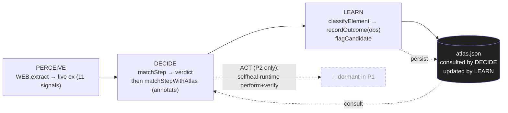

# IMPLEMENTATION-REFERENCE.md — learning brain + loop (P1 slice)

> Companion to `ok-make-a-new-vectorized-reddy.md` (strategy) and `/Users/prashant.kothari/.claude/plans/i-would-like-you-buzzing-goblet.md` (this slice's plan, post-redteam).
>
> **What this doc is:** the executable "how" — what the agent can perceive, where it is blind, how it learns, with pseudocode + tests + scenarios keyed to the *real* `selfheal-core.js` APIs.
>
> **What P1 honestly claims:** PERCEPTION (recognition), not healing or learning. The "retry under recipe" and "warm/passing-stats" paths need a runtime that does not exist until P2; they are present in shape but **dormant**, never faked.
>
> **Grounding (verified against source 2026-06-22):** thresholds `TH={heal:0.62, margin:0.12, abstain:0.45}`; `WEB.extract` → 11-signal ex; `buildFromEx` (core L44-50) prunes null/empty/weightless signals; `rank` scores all candidates against a *descriptor* — there is **no** score-against-CSS-selector API; suite base = **17** `test(` calls.

---

## §0 — A0 paper simulation (THE KILL-GATE — comes first)

Restates parent P1.1. Before any code or live-app probing, run a pencil-and-spreadsheet projection over **Gap-2's 11 labels** (the natural-drift corpus where the matcher currently heals 0/11).

**Artifact to produce:** `A0-paper-simulation.md` — one row per label, columns:

| label | drift type | matchStep today | (a) runner-up retry | (b) atlas recognition | (c) calibration tweak | projected useful_replay |
|---|---|---|---|---|---|---|
| … | … | fail/abstain | would heal? | classifies? to what? | floor-raise effect | yes/no |

**The three levers being projected (no code, just judgement per row):**
- **(a) runner-up retry** — would picking `ranked[1]` instead of abstaining have healed? (the cheap P2 lever)
- **(b) atlas recognition** — does the target classify as a known pattern? (does *not* heal in P1, but tells us if the brain even sees it)
- **(c) calibration tweak** — raise the floor for low-signal descriptors (e.g. `cls`-only): does it convert any false-heal → honest abstain?

**Gate rule:** if **no** lever projects `useful_replay > 20%` on paper, the brain direction is **parked** — we pivot to Clue-3 (author intent) or upstream test-id advocacy before spending engineering. Per the parent's honesty acknowledgment: *"A0 might kill the plan."*

**Ordering rule:** §9 live-app probing does **not** begin until this section is filled and at least one lever clears the bar.

---

## §1 — Perception: what the agent sees today

`WEB.extract(el, doc)` is the entire sensorium. Eleven signals, each with a heuristic stability weight (`DEF`, **UNCALIBRATED** per core L14). Critically, `buildFromEx` (L44-50) **drops** any signal that is `null`/`''` or lacks a `DEF` weight, *and* penalizes hashed `id`/`cls`.

| signal | source in extract | `DEF` weight | survives pruning when… | good at / blind to |
|---|---|---|---|---|
| `role` | `roleOf()` (aria-role or tag-inferred) | .90 | almost always present | **strong, stable**; coarse (many buttons) |
| `testid` | data-testid/test/qa/cy/automation | .95 | only if author added one | **strongest anchor**; absent on most 3rd-party UI |
| `name` | aria-label › label-for › value › text(<40) › placeholder | .50 | **dropped if element has no accessible name** | great for labelled controls; **gone for icon-only** |
| `nameAttr` | `<input name>` | .85 | form fields only | stable form identity; null outside forms |
| `type` | `<input type>` | .70 | typed inputs only | disambiguates inputs; null elsewhere |
| `autocomplete` | autocomplete attr | .80 | rarely set | high-value when present; usually absent |
| `id` | id attr (hashed → st .2) | .70 | present but **penalized if hashed** | stable-id is gold; SPA hashes are noise |
| `cls` | class attr (hashed → st .08) | .20 | present but **heavily penalized if hashed** | weak; emotion/styled-components classes are noise |
| `inForm` | `closest('form')` | .75 | **null (dropped) when not in a form** | context signal; binary |
| `formAction` | enclosing form action | .70 | forms only | scopes form submits; null elsewhere |
| `tag` | lowercase tagName | .50 | always | cheap; coarse |

**Honest statement of the sensorium:** the agent perceives **accessibility + identity markup only**. It does **not** perceive pixels, web layout geometry, author intent, or runtime behavior. Anything a screen-reader can't reach, the matcher can't either.

---

## §2 — Blind spots & honest limits (gaps + wiring-vs-learning, merged)

**What it is blind to** (each tied to a parent lever):
- **No author intent** — at record the human knows "I clicked Buy to start checkout"; at replay we see DOM only. → Clue-3 (parent OV#2), promote to early P2.
- **No visual / geometry on web** → P3+ visual fingerprint.
- **No real runtime outcome in P1** — "did the click work?" is *inferred from static markup*, not observed. → P2 `selfheal-runtime.js`.
- **Cross-origin memory loss** — `localStorage` is per-origin; an atlas learned on `amplitude.com` won't auto-load on `testsigma.com`. → Download/upload stopgap (P1), per-tenant store (P2).
- **Cold-start blindness** — a pattern with `< min_observations` cannot be trusted. → `min_observations:5` guard.
- **Noisy-verify contamination** — `urlChange` is high-confidence; `domChange` in an SPA is a maybe. → `verify_confidence` field (parent OV#4).
- **Signal-loss on recorded descriptors (B1)** — `buildFromEx` prunes the very signals that name an icon-only element. → **classify at perceive on the live ex, never on a recorded descriptor.**

**Wiring vs. learning (the honest split):**
- **What P1 wires (mechanism):** perceive → classify → log → flag → persist. The only counter that moves is `stats.observations`.
- **What P1 does NOT do:** improve any selector, change `DEF`/`DURA` weights, or heal anything. The counter's *only* behavioral effect in P1 is gating a branch that **doesn't execute until P2**.
- **The honest claim:** "we can perceive and name UI patterns, and log how often we encounter them." Compounding is a P2+ claim. A counter ticking 0→5 is not a moat.

---

## §3 — Loop diagram



No **ACT** node executes in P1 (greyed, dashed). The loop is perceive → decide → learn, with the atlas consulted by every decide and updated by every learn.

---

## §4 — Brain mockup (`atlas.json`) — with the REAL sparse descriptor

The atlas is JSON (not markdown). Each pattern keeps the parent's schema verbatim (`stats:{successes, failures, seen_on}`, `min_observations:5`); P1 adds an `observations` counter alongside and never writes `successes`/`failures`.

```json
{
  "version": 1,
  "patterns": [
    {
      "id": "modal-close-x",
      "match": { "role": ["button"], "name_any": ["close","dismiss","×","✕","x"], "name_absent_ok": true },
      "classify_at": "perceive",
      "recipe_P2": { "strategy": "role+name-or-aria", "selector_hint": "[aria-label*=close i],[aria-label*=dismiss i]" },
      "gotchas": ["may match cookie-banner close-X", "portaled outside modal root — scope needed"],
      "stats": { "successes": 0, "failures": 0, "seen_on": [], "observations": 0 },
      "min_observations": 5
    },
    {
      "id": "primary-form-submit",
      "match": { "role": ["button"], "name_any": ["submit","save","create","continue","next","confirm","send","sign up","sign in","log in"], "inForm_required": true },
      "classify_at": "perceive",
      "recipe_P2": { "strategy": "form-submit-button", "selector_hint": "form [type=submit],form button:last-of-type" },
      "gotchas": ["multiple submit-like buttons in multi-step forms", "inForm is null when form role is faked with div[role=form]"],
      "stats": { "successes": 0, "failures": 0, "seen_on": [], "observations": 0 },
      "min_observations": 5
    },
    {
      "id": "nav-logo-link",
      "match": { "role": ["link"], "name_any": ["home","homepage","logo","back to home"], "name_absent_ok": true },
      "classify_at": "perceive",
      "recipe_P2": { "strategy": "nearest-ancestor-nav-first-link", "selector_hint": "header a:first-of-type,nav a:first-of-type" },
      "gotchas": ["name drifts heavily across redesigns — Gap-2 label 3: 'Github'→'Homepage' → rank #34", "img-only logos have name=null"],
      "stats": { "successes": 0, "failures": 0, "seen_on": [], "observations": 0 },
      "min_observations": 5
    },
    {
      "id": "duplicate-row-action",
      "match": { "role": ["button","link"], "name_any": ["duplicate","copy","clone","edit","delete"] },
      "classify_at": "perceive",
      "recipe_P2": { "strategy": "row-scoped-by-container", "selector_hint": "[data-row-id] [aria-label*=duplicate i]" },
      "gotchas": ["N identical buttons in N rows — pattern alone can't disambiguate (needs Clue-2 container scope)", "honest P1 outcome: annotated-abstain, not heal"],
      "stats": { "successes": 0, "failures": 0, "seen_on": [], "observations": 0 },
      "min_observations": 5
    },
    {
      "id": "cookie-consent-accept",
      "match": { "role": ["button"], "name_any": ["accept","accept all","agree","allow","allow all","ok","got it","i agree","akzeptieren","aceptar"] },
      "classify_at": "perceive",
      "recipe_P2": { "strategy": "cookie-banner-primary-cta", "selector_hint": "[class*=cookie] button,[id*=consent] button" },
      "gotchas": ["may fire on non-cookie confirm dialogs with the same name", "banner portaled to body root"],
      "stats": { "successes": 0, "failures": 0, "seen_on": [], "observations": 0 },
      "min_observations": 5
    },
    {
      "id": "hamburger-menu-trigger",
      "match": { "role": ["button"], "name_any": ["menu","open menu","navigation","open navigation","toggle menu","nav"], "name_absent_ok": true },
      "classify_at": "perceive",
      "recipe_P2": { "strategy": "aria-expanded-button-in-header", "selector_hint": "header button[aria-expanded],header button[aria-controls*=nav i]" },
      "gotchas": ["name often absent (icon-only) — recipe relies on aria-expanded/aria-controls", "mobile-only drawer may conflict with desktop header button"],
      "stats": { "successes": 0, "failures": 0, "seen_on": [], "observations": 0 },
      "min_observations": 5
    },
    {
      "id": "icon-only-no-name",
      "match": { "role": ["button","link"], "name_absent_ok": true, "name_must_be_absent": true },
      "classify_at": "perceive",
      "recipe_P2": { "strategy": "testid-or-aria-label-fallback", "selector_hint": "button:not([aria-label]):not([data-testid])" },
      "gotchas": ["too broad — fires on many anchorless controls; flagCandidate is the correct action, not heal", "upstream fix is adding data-testid"],
      "stats": { "successes": 0, "failures": 0, "seen_on": [], "observations": 0 },
      "min_observations": 10
    }
  ],
  "candidate_patterns": []
}
```

**Why classification must run on the live ex, not the recorded descriptor (B1).** Take a real icon-only close button `<button aria-label="Close"><svg/></button>`. Suppose it had *no* aria-label (pure icon): its live ex is

```js
{ role:'button', tag:'button', name:null, nameAttr:null, type:null, autocomplete:null,
  testid:null, id:null, cls:'icon-btn', inForm:null, formAction:null }
```

After `buildFromEx` prunes nulls and weightless signals, the **recorded descriptor** is only:

```json
{ "role": {"v":"button","st":0.9}, "tag": {"v":"button","st":0.5}, "cls": {"v":"icon-btn","st":0.08} }
```

`name`, `inForm`, `formAction` are **gone**. So `name_absent_ok` can only be evaluated against the *live ex* (where `name===null` is observable) — on the recorded descriptor, "absent" and "never-extracted" are indistinguishable. **Rule: `classifyElement` always receives a live ex from `WEB.extract`.**

**Surviving signals per pattern** — shows exactly what `buildFromEx` will retain for a typical element matching each pattern. Critical for understanding why `classifyElement` runs on the live `ex`.

| pattern | typical element | signals that survive buildFromEx | signals pruned (null/absent) |
|---|---|---|---|
| `modal-close-x` | `<button aria-label="Close">✕</button>` | role=button, tag=button, name="Close" | testid, id, cls, nameAttr, type, inForm, formAction |
| `primary-form-submit` | `<button type="submit" name="commit">Save</button>` inside form | role=button, tag=button, name="Save", nameAttr="commit", type="submit", inForm=true, formAction="/update" | testid, id, cls |
| `nav-logo-link` | `<a href="/"></a>` (img logo, alt empty) | role=link, tag=a | name=null→pruned, testid, id, cls, inForm, formAction |
| `duplicate-row-action` | `<button aria-label="Duplicate row">⬓</button>` | role=button, tag=button, name="Duplicate row" | testid, id, cls, inForm |
| `cookie-consent-accept` | `<button id="accept-btn">Accept all</button>` | role=button, tag=button, name="Accept all", id="accept-btn" | testid, cls, inForm |
| `hamburger-menu-trigger` | `<button aria-label="Open menu" aria-expanded="false">☰</button>` | role=button, tag=button, name="Open menu" | testid, id, cls, inForm |
| `icon-only-no-name` | `<button class="sc-3a2f"><svg/></button>` (hashed class, no aria-label) | role=button, tag=button, cls="sc-3a2f" (weight 0.08) | **name=null→pruned**, testid, id, inForm |

The last row is the key case. `icon-only-no-name`'s defining signal is `name===null`. That null is **visible on the live ex**, but **gone from the recorded descriptor** (pruned). Classification must run at perceive time, not at replay time. `recipe_P2` is parked — it documents the future heal strategy; nothing in P1 executes it.

---

## §5 — Pseudocode per P1 function (against real APIs)

```text
# Parent's both-branch shape; the WARM branch is DORMANT in P1.
function matchStepWithAtlas(doc, step, atlas, opts):     # opts = optional 4th arg (superset of parent sig)
    base = matchStep(doc, step, opts)                    # REAL API, unchanged
    if base.verdict == 'heal' or base.best == null:
        return base                                      # matcher already won, or nothing to classify
    ex  = base.best.ex                                   # LIVE ex (full 11 signals) — NOT the recorded descriptor (B1)
    cls = classifyElement(ex, atlas)
    if cls == null:
        return base                                      # unrecognized → unchanged
    pat = atlas.patterns.find(p => p.id == cls.patternId)
    if pat.stats.successes >= pat.min_observations:      # WARM — unreachable in P1 (no runtime bumps successes) (B3)
        # P2 ONLY: rankUnderRecipe(doc, pat.recipe_P2, step) executes the heal here.
        return { ...base, pattern_id: cls.patternId, retry_attempted: true }   # P1: mark branch entry only
    return { ...base, pattern_id: cls.patternId, pattern_conf: cls.confidence } # COLD: abstain WITH pattern_id


function classifyElement(ex, atlas):                     # operates on a LIVE ex
    for pat in atlas.patterns:
        if matchesCriteria(ex, pat.match):
            return { patternId: pat.id, confidence: criteriaStrength(ex, pat.match) }
    return null


function matchesCriteria(ex, m):                         # only signals that survive extraction
    if m.role and ex.role not in m.role: return false
    if m.name_any:
        if ex.name == null:
            return m.name_absent_ok === true             # absent handled explicitly (B1)
        return any(fuzzy(ex.name, w) > 0 for w in m.name_any)   # REUSE core fuzzy (hardened)
    return true


function criteriaStrength(ex, m):                        # 0..1 — how strongly the ex matches (for ranking candidates)
    # weighted by which discriminating signals were present (name match > role-only)
    return weighted_fraction_of_criteria_satisfied(ex, m)


function recordOutcome(atlas, patternId, success, verify_confidence):   # PARENT API; pure → atlas'
    a = deepClone(atlas)
    pat = a.patterns.find(p => p.id == patternId)
    pat.stats.observations += 1
    addUnique(pat.stats.seen_on, piiStrip(currentOrigin()))
    if verify_confidence >= TH_VERIFY:                   # P1 always passes 'inferred' (low) → never bumps
        if success: pat.stats.successes += 1
        else:       pat.stats.failures  += 1
    return a                                             # successes/failures stay 0 in P1 (B3, OV#4)


function flagCandidate(atlas, ex):                       # pure → atlas'
    if bestLocator(ex).tier === 'none' AND classifyElement(ex, atlas) == null:   # anchorless + unknown (M4)
        a = deepClone(atlas)
        addUnique(a.candidate_patterns, compactSignature(ex))                    # {role,name?,cls?,seen_on}
        return a
    return atlas
```

**Loop closure in `live-inspector.js`** (the IIFE already has the live ex from `extract(el, document)`):

```text
# inside scan(), per candidate element:
ex  = extract(el, document)                              # full 11-signal live ex
cls = classifyElement(ex, atlas)
log({ el, ex, classified: cls })                         # console / __SELFHEAL_RESULT
if cls != null:
    atlas = recordOutcome(atlas, cls.patternId, /*success*/null, /*verify_confidence*/'inferred')
else:
    atlas = flagCandidate(atlas, ex)
# after the loop:
localStorage.setItem('selfheal_atlas_' + location.origin, JSON.stringify(atlas))
renderDownloadButton(atlas)                              # "Download atlas.json" — cross-origin stopgap (m3)
```

---

## §6 — Test examples (literal `test/ok/eq`; parent's 4 names; base verified 17, target ≥ 21)

Add to `selfheal-tests.js`; loaded via `window.SELFHEAL` in `selfheal-tests.html`. Helpers `parse`/`mount`/`captureStep`/`matchStep` already exist from the base suite.

```js
// ===================================================================== E8 atlas / brain
// Fixtures shared across the 4 tests — defined once in a block at the top of the E8 group.
const {classifyElement, matchStepWithAtlas, recordOutcome, flagCandidate} = S;

// Minimal single-pattern atlas for classifyElement and recordOutcome tests.
const ATLAS_FIXTURE = {
  version: 1,
  patterns: [{
    id: 'modal-close-x',
    match: { role: ['button'], name_any: ['close','dismiss','×','✕','x'], name_absent_ok: true },
    stats: { successes: 0, failures: 0, observations: 0, seen_on: [] },
    min_observations: 5
  }],
  candidate_patterns: []
};

// Cold: successes=0 < min_observations(5) → warm branch unreachable.
const COLD_ATLAS = ATLAS_FIXTURE;

// Warm: hand-seed successes to meet min_observations → warm branch entered.
const WARM_ATLAS = JSON.parse(JSON.stringify(ATLAS_FIXTURE));
WARM_ATLAS.patterns[0].stats.successes = 5;

// Shared step for tests 2 & 3: a Close button that matchStep cannot uniquely heal
// (two identical Close buttons → ambiguous → abstain). Built from a mounted live fixture
// so captureStep gets a real layout engine (required by bestLocator/uniqueAtRecord).
let _closeStep; // lazily built below inside test bodies that mount/unmount

test('classifyElement: aria-label Close button → modal-close-x', () => {
  const doc = parse(`<button aria-label="Close">✕</button>`);
  const ex  = S.WEB.extract(doc.querySelector('button'), doc);  // full live ex (B1)
  const res = classifyElement(ex, ATLAS_FIXTURE);
  ok(res !== null, 'should classify Close button');
  eq(res.patternId, 'modal-close-x');
  ok(res.confidence > 0, 'confidence non-zero');
});

test('matchStepWithAtlas-low-stats-abstains: cold → abstain WITH pattern_id', () => {
  // Two identical Close buttons → matchStep abstains (ambiguous, margin≈0).
  // Cold atlas (successes=0) → matchStepWithAtlas must NOT produce a heal; must annotate pattern_id.
  const d = mount(`<div>
    <button aria-label="Close">✕</button>
    <button aria-label="Close">✕</button>
  </div>`);
  try {
    const step = captureStep(d.querySelectorAll('button')[0], d, {action:'click'});
    const base = matchStep(d, step, {gate:false});
    eq(base.verdict, 'abstain', 'baseline: two identical Close buttons should abstain');

    const r = matchStepWithAtlas(d, step, COLD_ATLAS, {gate:true}); // gate ON
    ok(r.verdict !== 'heal',             'cold atlas must not produce a heal');
    eq(r.pattern_id, 'modal-close-x',   'cold path annotates pattern_id');
    ok(r.retry_attempted !== true,       'warm branch must not fire on cold atlas');
  } finally { unmount(d); }
});

test('matchStepWithAtlas-passing-stats-retries: warm → retry branch ENTERED (not heal in P1)', () => {
  // Same fixture — but WARM_ATLAS has successes=5 >= min_observations → warm branch entered.
  // Asserts branch ENTRY (retry_attempted===true). Heal execution itself is P2 (B2/B3).
  const d = mount(`<div>
    <button aria-label="Close">✕</button>
    <button aria-label="Close">✕</button>
  </div>`);
  try {
    const step = captureStep(d.querySelectorAll('button')[0], d, {action:'click'});
    const r = matchStepWithAtlas(d, step, WARM_ATLAS, {gate:true});
    ok(r.retry_attempted === true,  'warm branch must be entered when successes >= min_observations');
    eq(r.pattern_id, 'modal-close-x');
    // verdict may still be non-heal — recipe execution is P2; branch entry is P1's claim
    ok(r.verdict !== undefined, 'verdict present');
  } finally { unmount(d); }
});

test('recordOutcome-persists: observation counted, pure, successes untouched in P1', () => {
  // verify_confidence='inferred' (P1 always) → successes/failures MUST NOT change (B3/OV#4).
  const before = ATLAS_FIXTURE.patterns[0].stats.observations;
  const a2 = recordOutcome(ATLAS_FIXTURE, 'modal-close-x', true, 'inferred');
  ok(a2 !== ATLAS_FIXTURE,                              'must return a clone — not the input object');
  eq(a2.patterns[0].stats.observations, before + 1,    'observations must increment');
  eq(a2.patterns[0].stats.successes,    0,              'inferred must never bump successes (B3)');
  eq(ATLAS_FIXTURE.patterns[0].stats.observations, before, 'original atlas must not be mutated');
});
```

**Acceptance:** existing **17** green, reach **≥ 21**. At least one test runs `gate:true` (tests 2 and 3 both do). `WARM_ATLAS` exists only to exercise branch-entry logic — it is **not** a heal claim.

---

## §7 — Scenarios (perceive → decide → learn, with atlas delta)

**Scenario A — Modal close, recognized (brain adds nothing).**
Strong descriptor (`role=button` + `name="Close"`). `matchStep` likely **heals on its own** → `matchStepWithAtlas` returns early, never classifies. *Honest note: when the matcher already wins, the brain is a no-op.* Atlas delta: none.

**Scenario B — Anchorless icon button, no name (brain has signal the matcher lacked).**
`<button><svg/></button>` inside a dialog. `bestLocator.tier==='none'`; `matchStep` abstains ('no-identity'). Brain classifies the live ex as `icon-only-no-name` (role=button + name absent). Result annotated with `pattern_id`; `recordOutcome(..,'inferred')` bumps `observations` only. **This is the case the brain exists for.** Atlas delta: `icon-only-no-name.stats.observations += 1`, origin added to `seen_on`.

**Scenario C — Duplicate row action (brain honestly cannot help).**
Five identical `<button aria-label="Delete">` rows. `matchStep` abstains 'ambiguous' (margin < 0.12). The brain *recognizes* `duplicate-row-action`, but a CSS `selector_hint` would return all five too — **no new disambiguating signal exists**. So even in P2 the recipe can't resolve this without per-row context. P1: annotate + observation only; honest abstain stands. Atlas delta: observations += 1. *(This is M2 made explicit — the brain is most likely to engage exactly where a selector can't help.)*

**Scenario D — Unknown anchorless element.**
A custom `<div role="button">` widget with no name, no testid, hashed class. Unclassified + `tier==='none'` → `flagCandidate` parks its compact signature in `candidate_patterns` for later human curation (P2 viewer). Atlas delta: one new `candidate_patterns` entry.

**Scenario E — Cross-origin continuity is manual in P1.**
Atlas learned on `app.amplitude.com` is stored under that origin's `localStorage`. On `testsigma.com` it won't auto-load. Workaround: "Download atlas.json" → re-upload into the fresh session. Per-tenant store is P2. *No automatic cross-app compounding is claimed for P1.*

---

## §8 — Target-app perception briefs (gated behind §0 A0)

> **Gate:** these runs begin **only after §0 A0 is filled** and a lever clears the 20% bar. Probe = paste `live-inspector.js` (or inject via Chrome MCP) → `__SELFHEAL_INSPECT.scan()`.

**Ground-truth labelling protocol (M3) — do this BEFORE running classify:**
1. Sample N visible interactives (`candidates(doc).filter(isShown)`).
2. A human hand-labels each one's *true* pattern (or "none").
3. Run `classifyElement` on each.
4. Report **precision** (of those classified, how many correct) **and recall** (of those that should match a pattern, how many caught) — never "a criteria fired."
5. Pre-register the floors in `AMPLITUDE-RUN.md`'s header before looking at results (§10).

| app | expected-perceivable | known gotchas | why it's in the set |
|---|---|---|---|
| **Amplitude** (`app.amplitude.com`) | charts toolbar, nav, modals, form controls | calendar cells (geometry-only), hover-portaled menus (gated out), **dual nav** (×2 logo) | parent's primary complex-app target; the 30% recognition threshold lives here |
| **Testsigma** (own product) | known test-id conventions | you control the DOM → can *act* on findings (add test-ids upstream) | dogfood; validates the upstream-advisor P2 lever |
| **GitHub** | buttons, nav, repo actions | already in Gap-2 corpus | continuity with the A0 11-label simulation |
| **Amazon / Wikipedia** (.com/.de, en/de) | localized buttons/links | i18n drift — `name` changes across locales; tests fuzzy/role resilience | parent's P2 i18n corpus targets; early read on locale robustness |

**Deliverable:** `AMPLITUDE-RUN.md` — per-element classifications, recognized vs `candidate_patterns`, atlas state after, precision/recall vs ground truth, and an honest read: **recognition ≥ 30%** confirms direction; below that, next session flips toward Clue-3 / author intent before more pattern work.

---

## §9 — Recognition pre-registration (folded falsification stub)

To keep the 30% threshold falsifiable, record this **in `AMPLITUDE-RUN.md`'s header before the run**:
- **Metric:** recognition = *correct* classification vs hand-labeled ground truth (not "a criteria fired").
- **Report both:** precision floor and recall floor (propose: precision ≥ 0.7, recall ≥ 0.3 — adjust on paper in A0).
- **Denominator, fixed:** "visible interactives" = `candidates(doc).filter(isShown)`. No post-hoc redefinition.
- **Anti-gaming disclosure:** if criteria are broadened mid-analysis to lift recall, that change is logged in the run doc; recall is reported both before and after.
- The full `FALSIFICATION.md` (useful_replay floor, false-heal ceiling, atlas-retry lift) remains **P2** — only the recognition metric is pre-registered now because the P1 deliverable threshold depends on it.

---

## Execution checklist (when this slice is built — next round, not now)

1. Fill `A0-paper-simulation.md` → gate.
2. Add `atlas.json` (7 seeds, stats at zero).
3. Add to `selfheal-core.js`: `classifyElement`, `matchesCriteria`, `criteriaStrength`, `matchStepWithAtlas`, `recordOutcome`, `flagCandidate` → export on `SELFHEAL`.
4. Wire the loop + localStorage + Download button in `live-inspector.js`.
5. Add the 4 tests → keep 17 green, reach ≥ 21 (≥1 `gate:true`).
6. Only then: §8 live-app runs with the ground-truth protocol → `AMPLITUDE-RUN.md`.
